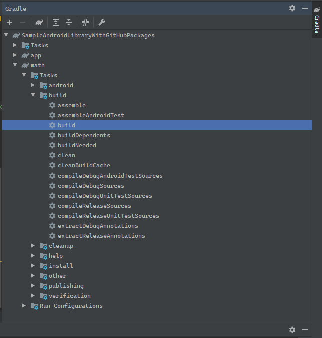
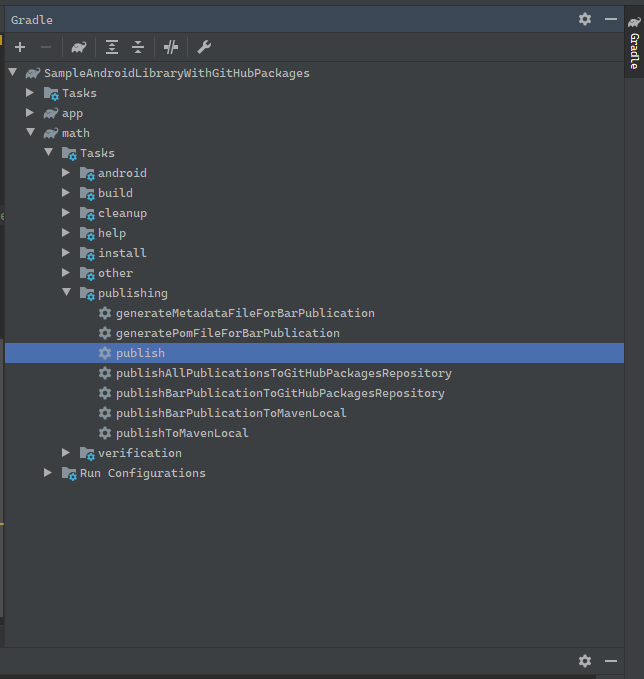

# Sample Android Library Publishing to GitHub Package Registry

This Android project showcases the steps to publish and consume Android Libraries on the GitHub Package Registry. It is made up of 2 modules 
1.  ##### sampleAndroidLibrary
   	
   	- Android library module with basic math functionality
   	- Publishes the generated library file onto the GitHub Package Registry
   	- The build.gradle file inside this module has the code (plugin, tasks and authentication) related to publishing the library
2.  #####  app
		
		- Sample Android application module with the build.gradle file that shows the code for consuming an Android library from GitHub Package Registry.
 
------------
## Part 1 Publishing an Android library to GitHub Package Registry

#### Step 1 Generate a Personal Access Token for GitHub
- Inside you GitHub account:
   - Settings -> Developer Settings -> Personal Access Tokens -> Generate new token
   - Make sure you select the following scopes (" write:packages", " read:packages") and Generate a token
   - After Generating make sure to copy your new personal access token. You won’t be able to see it again!

#### Step 2 Store your GitHub - Personal Access Token details
- Create a **github.properties** file within your root Android project
- In case of a public repository make sure you  add this file to .gitignore to keep the token private
   - Add properties **gpr.usr**=*GITHUB_USERID* and **gpr.key**=*PERSONAL_ACCESS_TOKEN*
   - Replace **GITHUB_USERID** with personal / organisation Github UserID and **PERSONAL_ACCESS_TOKEN** with the token generated in [**Step 1**](#step-1-generate-a-personal-access-token-for-github)
   - The file should look like this:

   ```javascript
   gpr.usr=GITHUB_USERID
   gpr.key=PERSONAL_ACCESS_TOKEN
   ```
   
> Alternatively you can also add the **GPR_USER** and **GPR_API_KEY** values to your environment variables on you local machine or build server to avoid creating a github properties file

#### Step 3 : Update build.gradle inside the library module
- Add the following code to **build.gradle** inside the library module
```javascript
apply plugin: 'maven-publish'
```
```javascript
def githubProperties = new Properties()
githubProperties.load(new FileInputStream(rootProject.file("github.properties")))  
```
```javascript
def getVersionName = { ->
   return "1.0.0"  // Replace with version Name
}
```
```javascript
def getArtificatId = { ->
   return "sampleAndroidLibrary" // Replace with library name ID
}
```
```javascript
publishing {
   publications {
      bar(MavenPublication) {
         groupId 'com.hifnawy.libraries' // Replace with group ID
         artifactId getArtifactId()
         version getVersionName()
         artifact("$buildDir/outputs/aar/${getArtifactId()}-release-${getVersionName()}.aar")
      }
   }

   repositories {
      maven {
         name = "GitHubPackages"
         /** Configure path of your package repository on Github
         *  Replace GITHUB_USERID with your/organisation Github userID and REPOSITORY with the repository name on GitHub
         */
         // url 'https://maven.pkg.github.com/GITHUB_USER_ID/REPOSITORY'
         url = uri("https://maven.pkg.github.com/abdalmoniem/SampleAndroidLibraryWithGitHubPackages")

         credentials {
            /**Create github.properties in root project folder file with gpr.usr=GITHUB_USER_ID  & gpr.key=PERSONAL_ACCESS_TOKEN**/
            username = githubProperties['gpr.usr'] ?: System.getenv("GPR_USER")
            password = githubProperties['gpr.key'] ?: System.getenv("GPR_API_KEY")
         }
      }
   }
}
```

#### Step 4 : Publish the Android Library onto GitHub Package Registry

> Make sure to build and run the tasks to generate the library files inside ***build/outputs/aar/*** before proceeding to publishing the library.


<!--  -->


- Execute the **Publish** gradle task which is inside your library module
   - you can either use the terminal:
      ```shell
      $ gradle publish
      ```
   - or just use the gradle task inside android studio:

   
   <!--  -->

- Once the task is successful you should be able to see the Package under the **Packages** tab of the GitHub Account
- In case of a failure run the task with *--stacktrace*, *--info* or *--debug* to check the logs for detailed information about the causes.
   
   

------------
## Part 2 Using a library from the GitHub Package Registry
> ~~Currently the GitHub Package Registry requires us to Authenticate to download an Android Library (Public or Private) hosted on the GitHub Package Registry. This might change for future releases~~

> ~~Steps 1 and 2 can be skipped if already followed while publishing a library~~

#### ~~Step 1 Generate a Personal Access Token for GitHub~~
   - ~~Inside you GitHub account:~~
   - ~~Settings -> Developer Settings -> Personal Access Tokens -> Generate new token~~
   - ~~Make sure you select the following scopes ("read:packages") and Generate a token~~
   - ~~After Generating make sure to copy your new personal access token. You won’t be able to see it again!~~

#### Step 2 Store your GitHub - Personal Access Token details
   - ~~Create a **github.properties** file within your root Android project~~
   - ~~In case of a public repository make sure you  add this file to .gitignore for keep the token private~~
   - ~~Add properties **gpr.usr**=*GITHUB_USERID* and **gpr.key**=*PERSONAL_ACCESS_TOKEN*~~
   - ~~Replace GITHUB_USERID with personal / organisation Github User ID and PERSONAL_ACCESS_TOKEN with the token generated in [**Step 1**](#step-1-generate-a-personal-access-token-for-github)~~
   
> ~~Alternatively you can also add the **GPR_USER** and **GPR_API_KEY** values to your environment variables on you local machine or build server to avoid creating a github properties file~~

#### ~~Step 3 Update build.gradle inside the application module~~
   - ~~Add the following code to **build.gradle** inside the app module that will be using the library published on GitHub Packages Repository~~

>~~def githubProperties = new Properties()
   githubProperties.load(new FileInputStream(rootProject.file("github.properties")))~~ 

>~~repositories {
      maven {
         name = "GitHubPackages"
         /*  Configure path to the library hosted on GitHub Package Registry
         *  Replace UserID with package owner userID and REPOSITORY with the repository name
         *  e.g. "https://maven.pkg.github.com/enefce/AndroidLibraryForGitHubPackagesDemo"
         */
         url = uri("https://maven.pkg.github.com/UserID/REPOSITORY")
         credentials {
            username = githubProperties['gpr.usr'] ?: System.getenv("GPR_USER")
            password = githubProperties['gpr.key'] ?: System.getenv("GPR_API_KEY")
         }
      }
   }~~


   - inside dependencies of the **build.gradle** of app module, use the following code
   ```javascript
   dependencies {
      repositories {
         maven {
            /** Configure path of your package repository on Github
            *  Replace GITHUB_USERID with your/organisation Github userID and REPOSITORY with the repository name on GitHub
            */
            // url 'https://maven.pkg.github.com/GITHUB_USER_ID/REPOSITORY'
            url 'https://maven.pkg.github.com/abdalmoniem/SampleAndroidLibraryWithGitHubPackages'
         }
      }
      
      //consume library
      implementation 'com.hifnawy.libraries:sampleAndroidLibrary:1.0.0'
      ...
   }
   ```